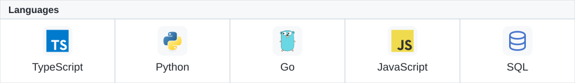
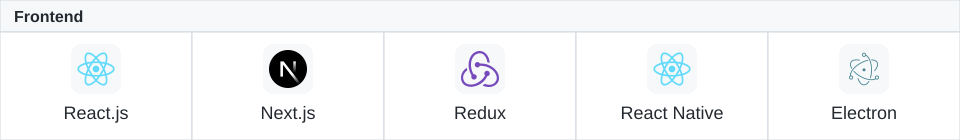
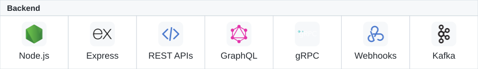
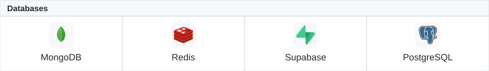
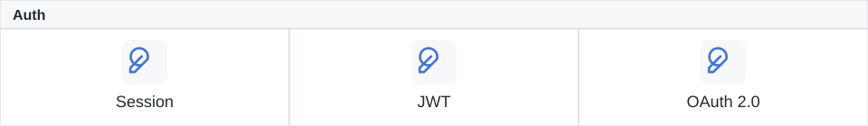
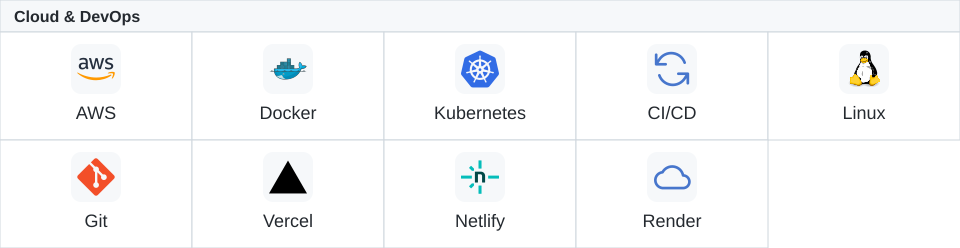
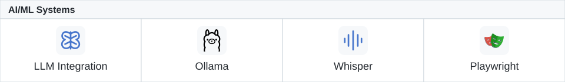
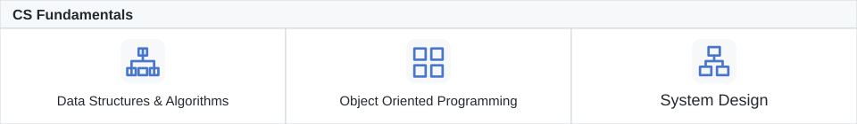

  
    
  
    

<table width="100%" align="center">
  <tr>
    <td align="center" valign="top" width="250">
      <a href="https://jaiminjariwala.netlify.app">
        <strong>Visit my portfolio website</strong>
      </a>
        
      
    </td>
    <td align="center" valign="top" width="250">
      <a href="https://component-library-six-eta.vercel.app">
        <strong>Explore my Component Library</strong>
      </a>
        
      
    </td>
    <td align="center" valign="top" width="250">
      <a href="https://github.com/jaiminjariwala/codex-lite/releases/latest">
        <strong>Try out Codex Lite macOS Desktop app!</strong>
      </a>
        
      
    </td>
  </tr>
</table>

  

<!-- guestbook:start -->
| Name | Date | Message |
|---|---|---|
| <a href="https://github.com/mihnea-popescu">&nbsp;mihnea-popescu</a> | 9/28/2026,&nbsp;3:13:47&nbsp;PM&nbsp;ET | Love&nbsp;this&nbsp;new&nbsp;profile!&nbsp;Keep&nbsp;up&nbsp;the&nbsp;good&nbsp;work... |
| <a href="https://github.com/ari-sax">&nbsp;ari-sax</a> | 9/28/2026,&nbsp;1:19:01&nbsp;PM&nbsp;ET | Yoo!&nbsp;Good&nbsp;stuff!&nbsp;We&nbsp;keep&nbsp;hustling.🙌🏻 |
| <a href="https://github.com/HetalLad">&nbsp;HetalLad</a> | 9/28/2026,&nbsp;10:39:10&nbsp;AM&nbsp;ET | Wow&nbsp;those&nbsp;animations&nbsp;are&nbsp;really&nbsp;amazing!!!... |
<!-- guestbook:end -->

  
  
  
  
  
  
  
  
  

<!-- coding-time: reserved for verified all-time tracking data -->

  

<!-- Retro layout and shared artwork: https://github.com/BrunnerLivio/brunnerlivio -->
