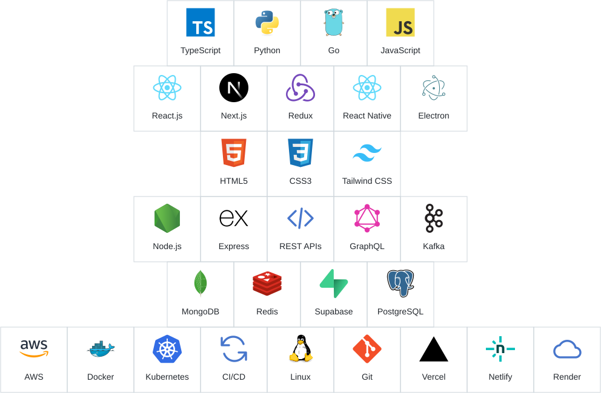

  
    
  
    

<table align="center">
  <tr>
    <td align="center" valign="top" width="190">
      <a href="https://jaiminjariwala.netlify.app">
        <strong>Visit my personal website</strong>
      </a>
        
      
    </td>
    <td align="center" valign="top" width="190">
      <a href="https://component-library-six-eta.vercel.app">
        <strong>Explore my Component Library</strong>
      </a>
        
      
    </td>
    <td align="center" valign="top" width="190">
      <a href="https://github.com/jaiminjariwala/codex-lite/releases/latest">
        <strong>Try out Codex Lite macOS Desktop app!</strong>
      </a>
        
      
    </td>
  </tr>
</table>

  

<!-- guestbook:start -->
<table align="center">
<thead><tr><th>Name</th><th>Date</th><th>Message</th></tr></thead>
<tbody>
<tr><td><a href="https://github.com/mihnea-popescu">&#8288;&nbsp;mihnea&#8209;popescu</a></td><td>9/28/2026,&nbsp;3:13:47&nbsp;PM&nbsp;ET</td><td>Love&nbsp;this&nbsp;new&nbsp;profile!&nbsp;Keep&nbsp;up&nbsp;the&nbsp;good&nbsp;work...</td></tr>
<tr><td><a href="https://github.com/ari-sax">&#8288;&nbsp;ari&#8209;sax</a></td><td>9/28/2026,&nbsp;1:19:01&nbsp;PM&nbsp;ET</td><td>Yoo!&nbsp;Good&nbsp;stuff!&nbsp;We&nbsp;keep&nbsp;hustling.🙌🏻</td></tr>
<tr><td><a href="https://github.com/HetalLad">&#8288;&nbsp;HetalLad</a></td><td>9/28/2026,&nbsp;10:39:10&nbsp;AM&nbsp;ET</td><td>Wow&nbsp;those&nbsp;animations&nbsp;are&nbsp;really&nbsp;amazing!!!...</td></tr>
</tbody></table>
<!-- guestbook:end -->

 

  

### 📊 Coding time so far

<!--START_SECTION:waka-->
<!--END_SECTION:waka-->

  

<!-- Retro layout and shared artwork: https://github.com/BrunnerLivio/brunnerlivio -->
